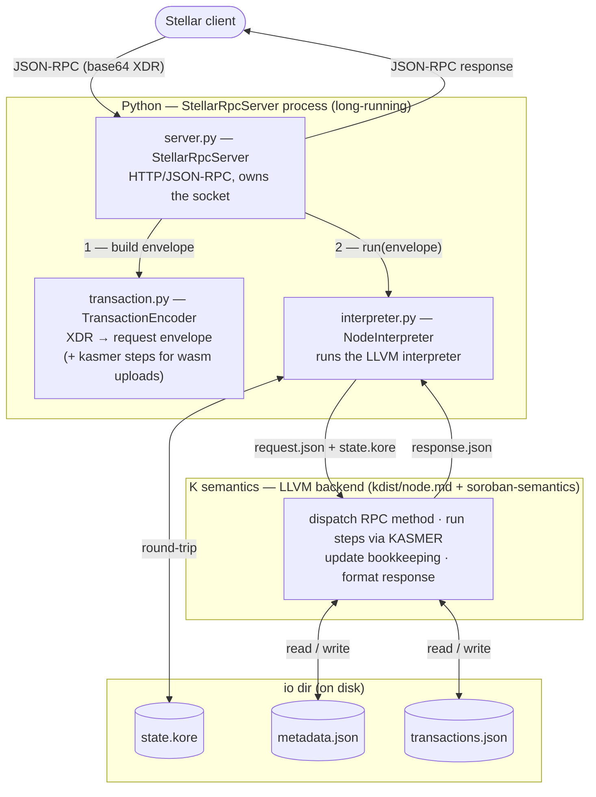
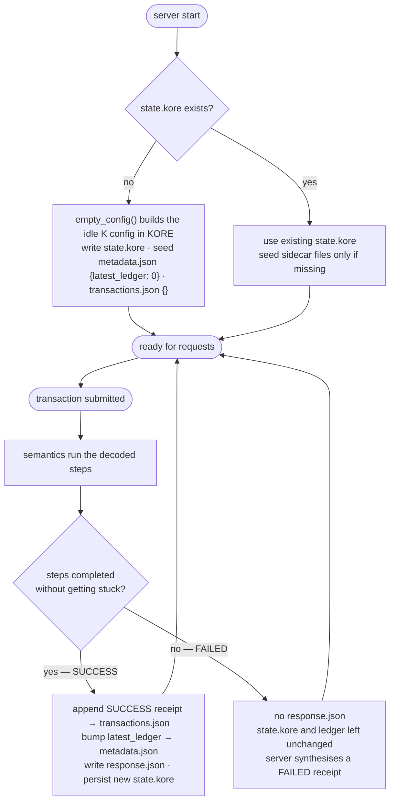
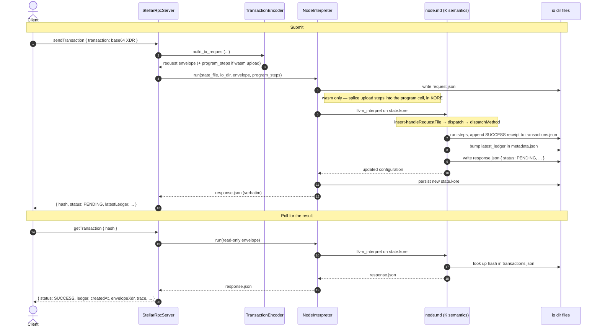

# komet-node: Architecture

## Overview

komet-node is a local Stellar testnet whose execution engine is the [K formal semantics](https://github.com/runtimeverification/komet) of Soroban. It decodes incoming Stellar transactions into K steps and executes them through the compiled semantics.

The split between Python and K follows one rule: K does everything that is part of the Soroban/Stellar protocol, and Python does only what K structurally cannot. The compiled K semantics are a *one-shot interpreter* — one invocation runs one request to completion and exits, with no network, no memory between invocations, and no decoder for Stellar's binary XDR format. Python supplies exactly those three missing pieces: it is the long-running process that holds the HTTP socket, it keeps the world state on disk between invocations, and it decodes the XDR envelope (and parses uploaded wasm). Everything else — RPC method dispatch, the transaction store, ledger-sequence accounting, status determination, and JSON-RPC response formatting — runs inside the K semantics (`node.md`).

---

## Components

### `server.py` — `StellarRpcServer`

`StellarRpcServer` is the long-running process around the semantics: a plain `http.server.HTTPServer` that keeps the HTTP socket open and the state files on disk across requests — the networking and persistence the one-shot K interpreter has no notion of. It receives JSON-RPC requests, uses `TransactionEncoder` to turn a transaction into a request envelope, hands the envelope to `NodeInterpreter`, and returns the `response.json` the semantics produced. It holds **no** ledger counter, transaction store, or response-formatting logic — those live in K.

`handle_rpc(method, params, id)` is the dispatch entry point and is usable without the HTTP layer (scripts, tests).

→ **[Detailed documentation](server.md)**

The server implements six RPC methods — `getHealth`, `getNetwork`, `getLatestLedger`, `sendTransaction`, `getTransaction`, and `traceTransaction` — and the K semantics answer all of them.

`sendTransaction` always returns `PENDING` and clients poll `getTransaction` for the result — matching the Stellar RPC async pattern even though the transaction executes synchronously. See [server.md](server.md) for details.

---

### `transaction.py` — `TransactionEncoder`

`TransactionEncoder` decodes Stellar's binary XDR transaction format, which K cannot parse. It turns a `stellar_sdk` transaction envelope into a JSON request envelope containing the RPC method, the transaction hash, the envelope XDR, and the decoded operations as JSON "steps". For the one case K cannot consume as JSON — a wasm upload, whose `ModuleDecl` has no JSON form — it produces the kasmer steps in K-AST form for direct injection into the `<program>` cell.

→ **[Detailed documentation](transaction.md)**

---

### `interpreter.py` — `NodeInterpreter`

`NodeInterpreter` runs request envelopes through the K semantics. It builds the initial configuration, feeds a request envelope to the LLVM interpreter against `state.kore`, and persists the resulting state. It knows nothing about Stellar. It performs **no** whole-configuration `kast`↔`kore` conversions — the initial config is built directly in KORE and request steps are spliced into the `<program>` cell at the KORE level.

→ **[Detailed documentation](interpreter.md)**

---

### `kdist/node.md` — K Semantics

`node.md` is the K module compiled into the LLVM binary. It implements the whole RPC layer on the K side: it reads `request.json`, dispatches on the `method` field, reads and updates the bookkeeping files (`metadata.json`, `transactions.json`), executes transaction steps via KASMER, and writes the JSON-RPC `response.json`. KASMER is the Komet execution harness whose `Step`s — `setAccount`, `deployContract`, `callTx`, `uploadWasm` — carry out the Soroban operations a transaction decodes into.

→ **[Detailed documentation](node-semantics.md)**

---

## State management

Server state is split across the *io dir* (the directory containing the state file, by default the working directory):

| File | Owner | Contents |
|---|---|---|
| `state.kore` | round-tripped by `NodeInterpreter` | the full K world-state configuration — accounts, contract code (incl. uploaded wasm `ModuleDecl`s), contract storage, ledger metadata — serialized in KORE |
| `metadata.json` | read/written by the K semantics | `{"latest_ledger": N}` — the server ledger counter |
| `transactions.json` | read/written by the K semantics | map from tx hash → stored receipt, answering `getTransaction` |

The world state stays in KORE (rather than a JSON snapshot) because an uploaded wasm module is a `ModuleDecl` that the semantics cannot reconstruct from bytes — only `wasm2kast` (Python) can produce it. The RPC bookkeeping, by contrast, is plain data and lives in the two JSON sidecar files, which the semantics read and write directly via the file-system hooks.

Because all three files live on disk, the server can be stopped and restarted without losing the world state, the ledger counter, or the transaction store. To resume a session, point `--io-dir` at a directory holding a saved `state.kore` (its sidecar files are read if present). To start fresh, point it at an empty directory.

---

## Request flow (end to end)

---

## Dependencies

| Dependency | Role |
|---|---|
| `komet` | Soroban K semantics, `SorobanDefinition`, `SCValue` dataclasses, `kasmer` step types |
| `pyk` | K toolchain Python bindings: `llvm_interpret`, `kdist`, KORE parsing/prelude, `kast_to_kore` (only for the wasm module) |
| `pykwasm` | Wasm → K AST conversion (`wasm2kast`), used for the wasm-upload step |
| `stellar_sdk` | Stellar transaction types, XDR encoding/decoding, `TransactionEnvelope` |

---

## What's not yet implemented

- `resultXdr` / `resultMetaXdr` in `getTransaction` responses (contract return values)
- `simulateTransaction` (dry-run without state mutation)
- `getEvents`, `getLedgerEntries`, `getFeeStats` and other read-only RPC methods
- `ExtendFootprintTTL` and `RestoreFootprint` operations
- `SCVec` / `SCMap` contract-argument types in the request encoder (`scval_to_json`)
